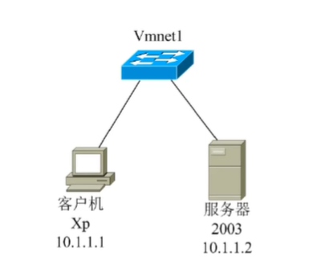

## 服务器远程管理



### 远程桌面

```
步骤：
1. 首先将配置网络， 并实现客户机与服务器可以互通
2. 服务器开启允许远程控制：桌面右键属性 -- 远程设置 -- 选择允许 -- 确定
3. 客户机上： 开始 -- 运行 -- 输入 mstsc 打开远程连接工具
4. 在 mstsc 工具上输入服务器的IP并点击确定
5. 输入服务器的账号及密码

注意： 如果非管理员庄户登录远程，需要在服务器上将用户加入到远程桌面内置组 Remote Desktop Users中。其中需要关闭防火墙。
```

### telnet

远程命令行端口

`telnet`是直接在命令行使用的，客户端使用前提是需要服务器将该用户加入`TelnetClients`组中。

且服务器端运行 `services.msc`打开`telnet`服务

使用方法： telnet + IP地址

`exit`退出

### 开放端口

使用命令 `netstat -an` 查看所有开启的服务

其中

`23`是针对 `telnet `的服务

`3389`是针对 `远程桌面协议RDP`的服务