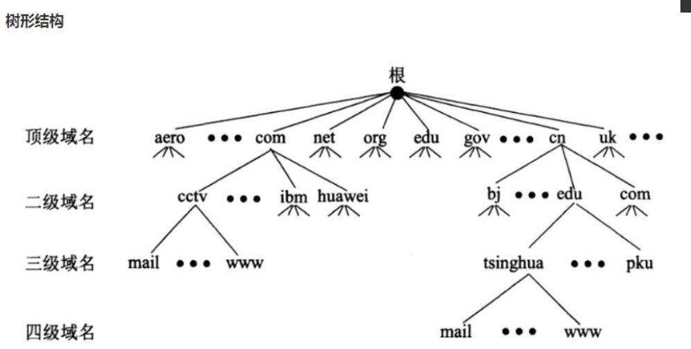
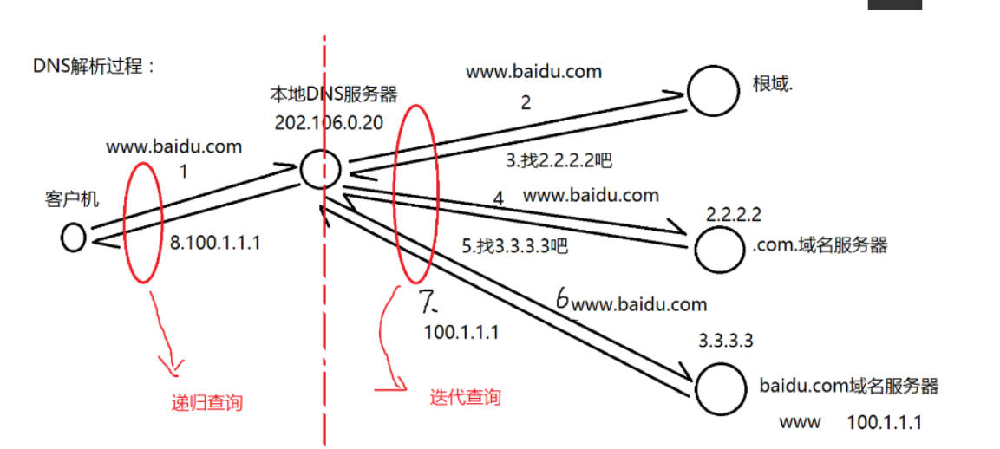
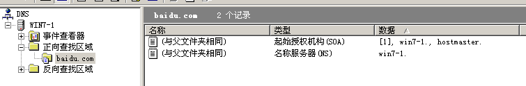
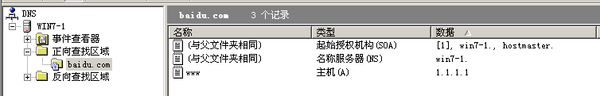
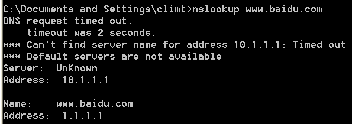
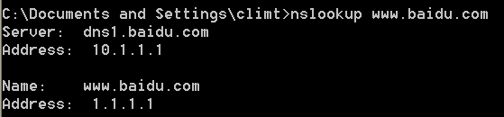
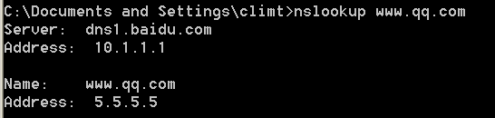

## DNS部署与安全

### DNS

Domain Name Service

域名服务

作用: 为客户机提供域名解析服务

### 域名组成



根域	.

```
如：www.baidu.com.
.为根域名
.com 为顶级域名
.baidu.com 为二级域名
www.baidu.com 为完整域名
www 为主机名
```

```
FQDN = 主机名.DNS后缀
FQDN(完整合格的域名)
```

### 端口

```
TCP: 53
UDP: 53
```

### DNS 解析种类

#### 按照查询方式分类：

```
1. 递归查询： 客户机与本地DNS服务器之间
2. 迭代查询： 本地DNS服务器与根等其它DNS服务器之间的解析过程
```



#### 按照查询内容分类：

```
1. 正向解析： 已知域名，解析IP地址
2. 反向解析： 已知IP地址，解析域名
```

### DNS服务器搭建

#### 开启DNS服务

1. 给服务器设置静态IP地址
2. 点击光驱安装windows组件,从中找出网络服务,选中DNS服务(弹找不到文件,让文件位置执行光驱位置)
3. 这个时候 TCP53 和 UDP53 端口就开放了

#### 解析 baidu.com 域名

1. 打开DNS

2. 正向查找区域新建区域, 选择主要区域,并创建区域名称 baidu.com.这意味该服务是 `baidu.com`的权威服务器, 权威服务器就是从该服务器给出的应答是最准确的.

   ```
   区域类型:
   1. 主要区域,就是创建一个新的DNS服务器
   2. 辅助区域,就是创建一个备份的DNS服务器
   3. 存根区域,就是创建一个根服务器,国家级的.
   所以选择 主要区域
   ```

3. 默认创建新文件 baidu.com.dns

4. 默认不接受资源记录的动态更新

5. 点击完成后,在正向查找区域中就有一个 `baidu.com`的文件, 则之后会在右侧空白处新建解析记录

   

   ```
   其中SOA(起始授权机构)就是,谁是baidu.com的权威解析服务器, 显然就是服务器自己,所以名称就是(与父文件夹相同).
   NS(名称服务器)就是之后不仅权威服务器可以解析baidu.com,还可以有一些辅助(备份)DNS服务器来解析baidu.com域名.
   ```

#### 解析baidu.com主机

1. 右键新建主机(A记录)

2. 主机名称: www, 设置IP地址：1.1.1.1

   

3. 使用winxp测试

   winxp 设置自定义DNS的IP地址 1.1.1.1, 且使用`nslookup`访问`www.baidu.com`

   

#### 给DNS服务器配置一个域名

1. 首先在正向查找区域里面给自己起个名字

2. 新建主机, 主机名称: dns1, FQDN: dns1.baidu.com, IP 地址: 10.1.1.1

3. 勾选创建相关的指针(PTR)记录

4. 在反向查找区域里面新建区域

5. 设置网络ID: 10.1.1, 完成

6. 选择 10.1.1.x Subnet, 新建PTR指针

7. 设置主机IP号: 10.1.1.1

8. 主机选择为 dns1.baidu.com

   

#### DNS转发器

1. 再创建一台DNS服务器, IP 设为 10.1.1.3

2. 在2号DNS服务器中的正向查找区域新建qq.com区域

3. 在 qq.com 中新建主机 www

4. 在1号DNS服务器中,选择主机 win2003-1, 右键属性.

5. 根提示可以看到世界上所有的根服务器域名及其IP地址

6. 选择转发器, 添加IP 10.1.1.3

7. 客户机执行nslookup

   

#### DNS备份

让2号DNS服务器有1号DNS服务器的某个区域的记录,可以自动备份过去,不用手动备份.

1. 1号DNS服务器选择 baidu.com ,右键属性,选择`区域复制`
2. 点击只允许到下列服务器, 选择IP地址为　10.1.1.3
3. 2号DNS服务器选择新建区域,同时选择`辅助区域`, 因为这个区域是1号DNS服务器baidu.com 的备份区域
4. 区域名称为 baidu.com, IP 地址为 10.1.1.1
5. 这个时候你在1号DNS服务器给 baidu.com 域名添加主机时, 会同步到 2号主机的 baidu.com 区域

#### 虚拟机上网

1. 确定本机连的是哪个网卡, 也就是确定连的是有线的还是无线的
2. 虚拟机使用网卡 VMnet0 , 可以让虚拟机连到真实的交换机上
3. 关掉自定义DNS, DHCP服务器等

#### 主机新建别名

1. 右键新建别名
2. 设置别名 wc.baidu.com
3. 目标主机选择为www.baidu.com就可以了
4. Aliases 就是代表别名

### DNS命令

```
nslookup IP 显示IP对应的域名
ipconfig /flushdns 清理 DNS 缓存
ipconfig /displaydns 展示 DNS 缓存
```

### 总结

在一个局域网内搭建一个DNS服务器，新建区域，如baidu.com, 那么这个局域网内的所有计算机访问 baidu.com 的任何FQDN都会从该台DNS服务器解析,这是因为该服务器就是baidu.com 的权威解析(SOA)

